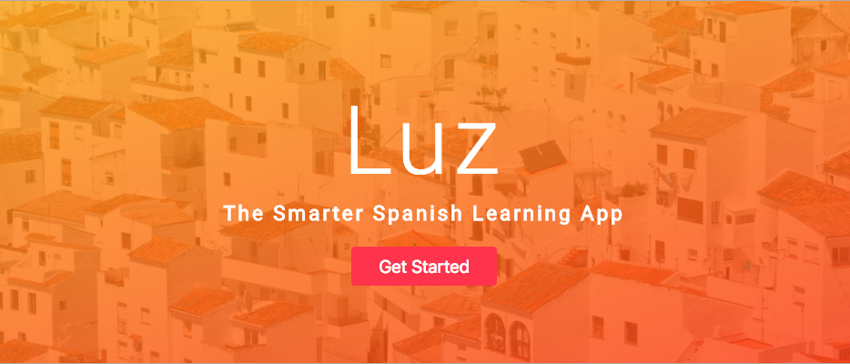
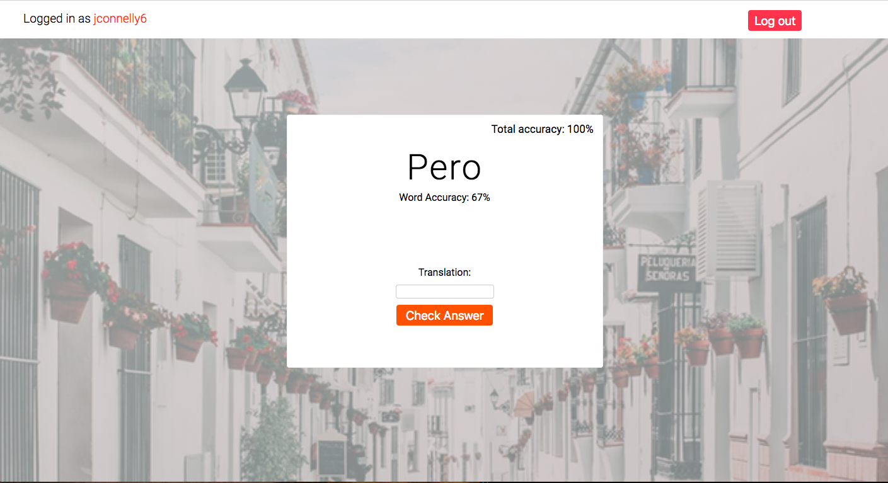

# Luz

> A Spanish language learning app made to help you learn with a spaced repetition learning methodology - built with Node.js, React.js, Redux, MongoDB/Mongoose and Express.

# Features

> Luz is centered around spaced repetition, or the idea of a 'forgetting curve'.  We built a linked list data structure that employs or spaced repetition pattern, so users will receieve the vocab questions they are struggling on more often.
* Receive vocab words specific to your user account
* When questions are answered correctly, cards go to the back of the stack. 
* When answered incorrectly, you'll see that vocab word more often
* Tracks your total accuracy per session
* Tracks your individual word accuracy that persists in the database for each user. 

# Link to Server Repo:

> https://github.com/JohnLCastillo/spaced-repetition-server

# Demo

> https://wonderful-shirley-bab865.netlify.com/

# Tech Stack

* Front End: React.js & Redux, CSS3 with Flexbox & Mobile Responsiveness
* Back End: Node.js, Express.js, REST API endpoints, MongoDB, Mongoose, Passport, bcryptjs
* Workflow: Git, Github, Heroku, Netlify, NPM, Yarn, Trello

# Screenshots

> Header

> 

> User Dashboard View

>

